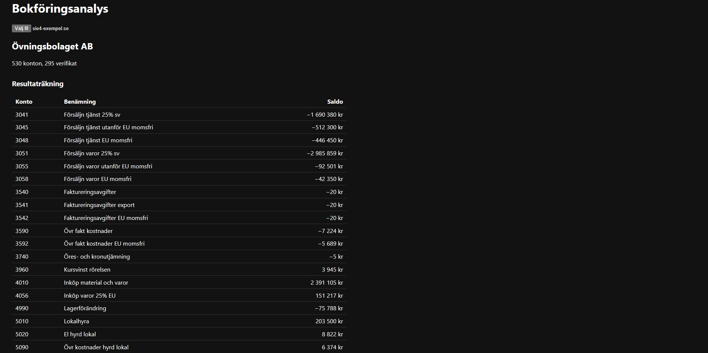

# Bokföringsanalys

Webbapp som läser in svensk bokföring i SIE4-format och gör den analyserbar - kontoplan, verifikat, resultat- och balansräkning samt nyckeltal i ett gränssnitt istället för i ett bokföringsprogram.

## Varför SIE

SIE är den svenska de facto-standarden för att flytta redovisningsdata mellan system. Alla större bokföringsprogram - Fortnox, Visma, Bokio - exporterar det, och Skatteverket accepterar det. Det gör formatet till en systemoberoende ingång till redovisningsdata.

Formatet är taggbaserat och teckenkodat i CP437 (`#FORMAT PC8`), med citerade och ociterade fält om vartannat och dimensioner i måsvingar (`{1 Nord 6 0001}`) som ser ut som fältseparatorer men inte är det. Parsern hanterar alla varianterna.

## Arkitektur

| Del | Teknik | Ansvar |
|-----|--------|--------|
| `api/` | Java 17, Spring Boot | Parsar SIE4, beräknar saldon, exponerar REST-API |
| `analys/` | Python, FastAPI | Nyckeltal ovanpå saldona |
| `webb/` | React, TypeScript, Vite | Gränssnitt |

Java anropar Python-tjänsten och skickar med nyckeltalen i sitt svar, så frontend behöver bara ett anrop. Ligger analystjänsten nere svarar API:et ändå - utan nyckeltal, men med kontoplan, verifikat och saldon intakta.

## Beslut värda att nämna

**BigDecimal och Decimal, inte flyttal.** Pengar avrundas inte i en balansräkning. `double` kan inte representera 0.1 exakt, så avrundningsfel byggs upp över tusentals transaktioner.

**Ingående balanser läses in.** Ett kontosaldo är ingående balans plus årets rörelser. Utan `#IB`-raderna saknas aktiekapital och tidigare vinster, och soliditeten blir meningslös - det upptäcktes när nyckeltalet gav ett orimligt värde.

**Testerna validerar mot domänen, inte mot handskrivna värden.** Testsviten kontrollerar att varje inläst verifikat summerar till noll, och att summan av alla kontosaldon är noll. Det följer av dubbel bokföring, och håller för vilken korrekt SIE-fil som helst - inte bara exempelfilen.

## Köra lokalt

Backend (Java, port 8080):
cd api
./mvnw spring-boot:run

Analystjänst (Python, port 8000):
cd analys
python -m venv .venv
.venv\Scripts\activate
pip install -r requirements.txt
uvicorn app.main:app --reload --port 8000

Frontend (port 5173):
cd webb
npm install
npm run dev

Öppna http://localhost:5173 och ladda upp en SIE4-fil. En exempelfil finns i `api/src/test/resources/`.

## Tester
cd api && ./mvnw test
cd analys && pytest

Båda sviterna körs automatiskt vid varje push via GitHub Actions.

## Status

Fungerar: parsning, saldoberäkning, resultat- och balansräkning, nyckeltal, REST-API och gränssnitt.

Nästa steg: Docker Compose för att starta hela stacken med ett kommando, drill-down från konto till verifikat, och stöd för att jämföra flera räkenskapsår.
